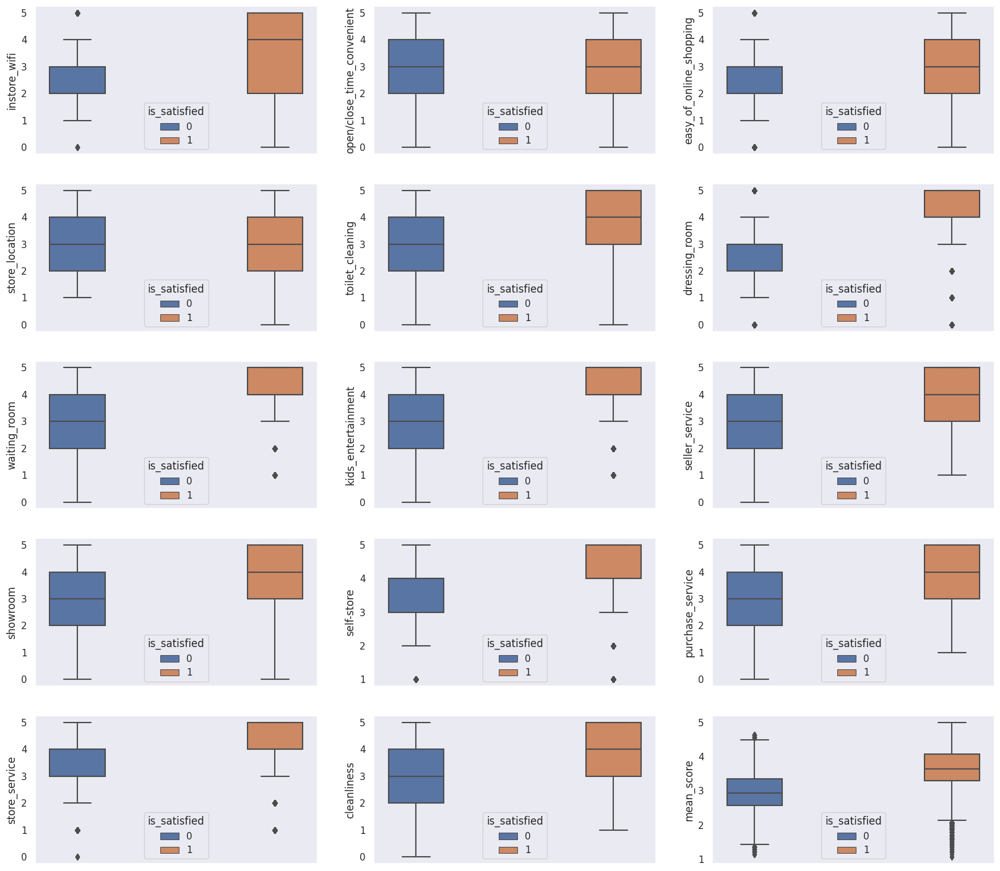

# InStyle Net Promoter Score - HackDays Comunidade DS, 5th Edition

**Date:** July the 15th and 16th of 2023

**Team:** 
- Bruno Piato, 
- Caio Slowik, 
- Juliani Chagas, 
- Kaique Faustino 
- Mattheus Gomes

In this project we used a Kaggle dataset to train a supervised learning classification algorithm to predict the customer's satisfaction with the InStyle stores based on the Network Promoter Score and the client's experience. 

<!-- TOC -->

- [InStyle Net Promoter Score - HackDays Comunidade DS, 5th Edition](#instyle-net-promoter-score---hackdays-comunidade-ds-5th-edition)
- [1. The Business Problem](#1-the-business-problem)
- [2. The approach](#2-the-approach)
- [3. The dataset](#3-the-dataset)
- [4. Exploratory Data Analysis](#4-exploratory-data-analysis)
  - [4.1 NPS Score Distributions](#41-nps-score-distributions)
  - [4.2 Correlation Between Features](#42-correlation-between-features)
- [5. Implementing Machine Learning Algorithms](#5-implementing-machine-learning-algorithms)

<!-- /TOC -->

# 1. The Business Problem
The InStyle Company is a big fashion company based in the US. They are going through some customers satisfaction issues, probably due to their expansion process. One of the biggest challenges of growing the income and revenue of a brand or store is to maintain the product's quality, the sales service and the customer's experience in high standards.

As the company expands reaching more and more clients, the internal sales processes begin to face issues and problems. Since the product's conception all the way to the payment services play an important role to the satisfaction level of the customers.

The product development team start to find difficult to determine the needs and desires of the majority of the clients. The marketing team face challenges to determine the ideal client profile. The e-commerce team suffers with high and intense volumes of webpage visits and buy attempts, causing system wreckage and site problems, making it offline for hours, which impacts enormously the income and revenue. Besides all these problems, the customers begin to complain about different aspects of the experience of purchasing from the brand. 

To solve this problem and mitigate its effects an interdisciplinary team is called to the 'War Room', where professionals from the product development area, the marketing area, the e-commerce area and the data analytics area are gathered to brainstorm, discuss and find a solution to deal with the issues the company is facing and improve the satisfaction levels of the customers.

One of the main strategies to deal with this challenge is to identify different aspects of the clients satisfaction index through a Net Promoter Score (NPS), a metric to assess the customers' satisfaction index concerning different aspects of the business. This is a very important step towards this challenge solution because it provides insights to improve the customers service. 

With the NPS results in hands the data science and analytics team is designated to develop and train a machine learning algorithm to classify new customers as they answer the NPS as "Satisfied" and "Neutral/Unsatisfied" so the marketing team can reach for unsatisfied customers, gather information about the reasons they are not satisfied with the company and improve the company's services. 

---
# 2. The approach

To approach and solve this problem we used the CRISP-DS method. It consists of a cyclic set of steps, beginning with the comprehension of the question and the business characteristics. After that we gather the data necessary to accomplish the goal we planned. 

With the dataset in hands we began the data cleaning and wrangling phase, which consisted of dealing with missing values, duplicated rows and outliers. An Exploratory Data Analysis was conducted to create and assess more than twenty different hypothesis so we could get a better understanding of the business problem and the characteristics of the dataset.

A step of data engineering was conducted to derive some new features from the features we already had in the dataset and prepare it to be modelled. We used different kinds of data scaling and transformation to get the data as ready as possible for the machine learning algorithms we decided to test.

We tested the performance of four different kinds of supervised-learning classification algorithms: Random Forest Classifiers, XGBoost Classifiers, LightGBM Classifier and CatBoost Classifier. To compare the performance of the algorithms we used the precision metric sub-setting the dataset to keep 80% of it to train the models and 20% to test its predictions.

The LightGBM Classifier was the best performing algorithms among the ones we tested and so was chosen to be used further in the hyperparameter fine-tuning to reach for the best possible performance.

---

# 3. The dataset

The dataset was obtained directly from the Kaggle page of the competition: https://www.kaggle.com/competitions/instyle-nps/overview

The train data was composed, in total, of 24 columns representing the features and around 130 thousand row comprising the entries for each purchase evaluation by the customers. 

Among these 24 features, we had:

- *ID*: The client's identification number
- *Gender:* The client's gender
- *Age:* The client's age
- *Type of Purchase:* Which the purchase was made for personal usage or gift
- *Store size:* The size of the store (i.e. small, medium and big)
- *Store distance:* Distance from downtown
- *InStore wifi:* Satisfaction level with the in store wi-fi
- *Open/Close time convenient:* Satisfaction level with opening and closing times of the store
- *Easy of online shopping:* Satisfaction level with the online shopping service
- *Store location:* Satisfaction level with the access to the store
- *Toilet cleaning:* Satisfaction level with the toilet cleaning
- *Dressing room:* Satisfaction level with the dressing rooms
- *Waiting room:* Satisfaction level with the waiting room of the store
- *Kids entertainment:* Satisfaction level with kids entertainment service
- *Seller service:* Satisfaction level with the store attendants
- *Showroom:* Satisfaction level with the store's showroom
- *Self-Store:* Satisfaction level with self-storage service
- *Purchase service:* Satisfaction level with payment service
- *Store Service:* Satisfaction level with the overall service of the store
- *Cleanliness:* Satisfaction level with the overall cleanliness of the store
- *Carrier delay in minutes:* The amount of time in minutes that the carrier delayed their departure from the store
- *Delivery delay in minutes:* The amount of time in minutes that the products delayed to be delivery at the customer's delivery address.

---

# 4. Exploratory Data Analysis

## 4.1 NPS Score Distributions
When we look to the distribution of the evaluation scores for each criteria, we can notice that some criteria have very different score distribution between Satisfied and Neutral/Unsatisfied customers.

For example, the score for in store wi-fi service are more widespread among satisfied customers than among unsatisfied. This can lead us to think that this was not a determinant feature to define which a person is or is not satisfied with the store.

Other features such as open/close time and store location did not differ substantially between satisfied and unsatisfied customers, leading us to think that they are not important features to determine a customer's satisfaction.

However features as dressing room. waiting room and kids entertainment service tend to comprise the biggest differences between satisfied and unsatisfied customers, indicating that these features may be very important to determine a customer's satisfaction index. 

The overall mean score for satisfied customers was around 3.62 with standard deviation of 0.59, while the overall mean score for unsatisfied customers was around 2.95 with standard deviation of 0.56, which means that, in general notes bellow 3.0 points are indicative of poor quality perception by the customers.

## 4.2 Correlation Between Features

To understand a little better the relation between features, we constructed a correlation plot. We can observe that there are a few variable highly correlated such as the cleanliness score and the scores for toilet cleaning, waititing room and kids entertainment. The ease of online shopping is correlated to the in store wi-fi quality as well. It seems that these features vary together and influence each other.

--- 

# 5. Implementing Machine Learning Algorithms

